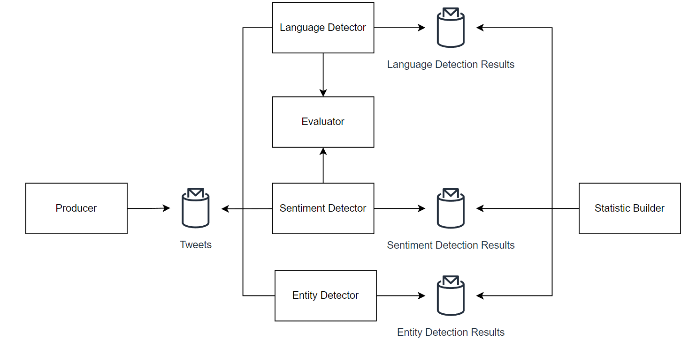

# Overview

This repository implements E2E data pipeline using kafka for processing twitter data.

# Architecture

1. Producer - reads first 100_100 rows of [historical twitter dataset](https://www.kaggle.com/datasets/kazanova/sentiment140).
2. Evaluator - responsible for language and sentiment model execution
3. Language Detector - reads tweets and calls Evaluator
4. Sentiment Detector - reads tweets and calls Evaluator
5. Entity Detector - reads tweets and searches for @ symbol
6. Statistic Builder - aggregates detection results using Kafka Streams

# How To Run

1. `docker-compose -f docker-compose-service.yml up --build`
2. `docker-compose -f docker-compose-app.yml up --build`

**Note**: you may need to restart both files 1-2 times initially because kafka not always connects on the first launch.

Statistic is available on `http://localhost:8000` and has following endpoints:

1. `/languages` - languages distribution
2. `/sentiments` - sentiments distribution
3. `/entities` - top 10 most used entities 